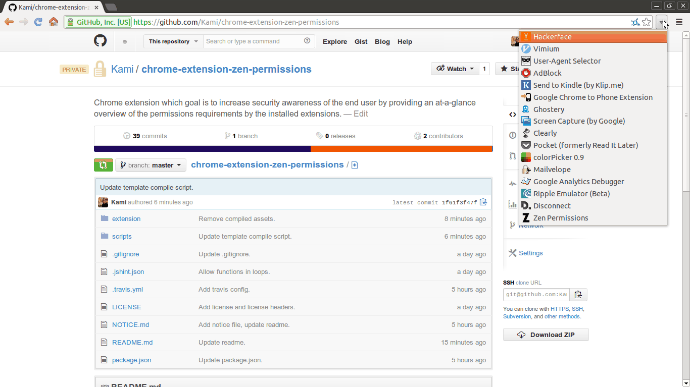

# Zen Permissions Chrome Extension

Primary goal of this extension is to increase security awareness of the end
user by providing an at-a-glance overview of the permissions requirements by
the installed extensions.

# Demo



## Using an Extension

Before you can use this extension (e.g. use "Load unpacked extension" feature
in Chrome) you need to compile included Handlebars.js template:

```bash
./scripts compile-templates.sh
```

## Preparig an extension package

```bash
./scripts/package-extension.sh
```

## License

Program is distributed under the [Apache license](http://www.apache.org/licenses/LICENSE-2.0.html).

Other third-party components in this repository might be licensed under
different licenses, for more info, please see
[NOTICE.md file](https://github.com/Kami/chrome-extension-zen-permissions/blob/master/NOTICE.md).
